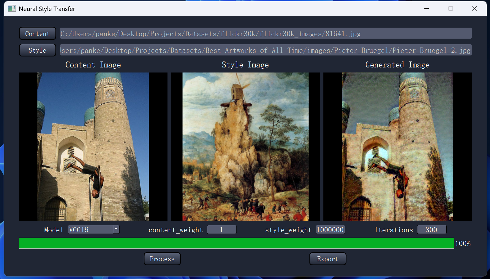

# Neural Style Transfer


This project aims to preform Neural Style Transfer using VGG19 pretrained model. The project also provides a GUI that lets you upload your own image.



### Build: 

	CPU: Intel i9-13900H (14 cores)
	GPU: NVIDIA RTX 4060 (VRAM 8 GB)
	RAM: 32 GB


### Python Packages:

	conda install pytorch==2.1.2 torchvision==0.16.2 torchaudio==2.1.2 pytorch-cuda=12.1 -c pytorch -c nvidia
	conda install -c conda-forge tqdm = 4.64.1
	conda install -c conda-forge matplotlib = 3.8.0
	conda install -c conda-forge numpy = 1.26.4


### Code Structure:
```bash
├── GUI.py (Run to generate a GUI)
├── main.py
├── model.py
├── qt_main.py
├── visualization.py

```		


### Credits:
	https://pytorch.org/tutorials/advanced/neural_style_tutorial.html
	